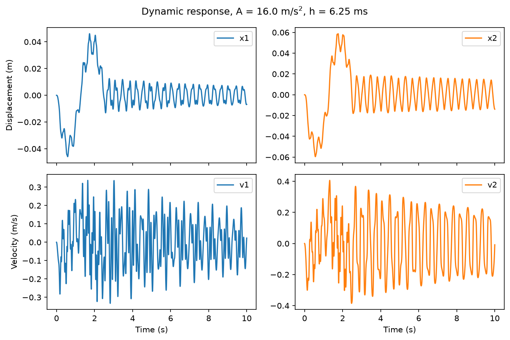
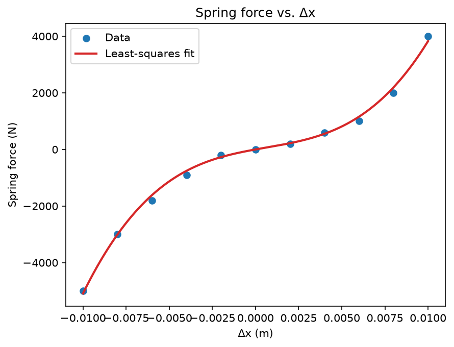
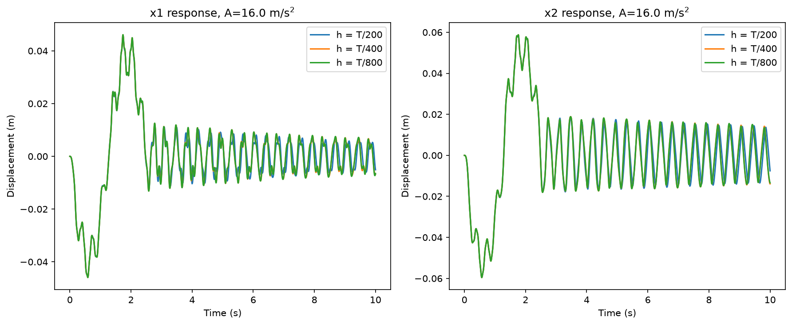
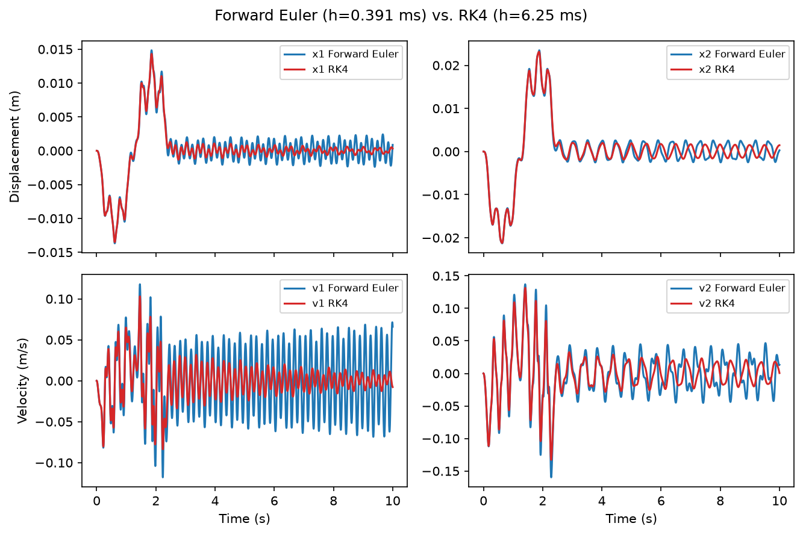

# Seismic Response of a Two-Story Building Model

Numerical simulation of a two-story shear building subjected to earthquake ground
motion, using a nonlinear spring-damper model for the inter-story connection.

<p align="center">
  
</p>
## Overview

The building is modelled as two lumped floor masses connected by a nonlinear
spring and damper (representing structural stiffness and a shock-absorber-style
damping mechanism), sitting on a linear-elastic foundation. The equations of
motion are two coupled, nonlinear 2nd-order ODEs driven by a sinusoidal
earthquake ground acceleration.

This project:

- Fits the nonlinear spring (cubic) and damper (quadratic) force models to
  experimental-style data using a polynomial least-squares regression solved
  directly from the normal equations (no `numpy.polyfit`).
- Converts the coupled 2nd-order equations of motion into a system of four
  1st-order ODEs.
- Solves the system with a 4th-order Runge-Kutta (RK4) integrator, written
  from scratch and verified against a known analytical solution (`dy/dt = y`).
- Runs a timestep-independence study to choose an appropriate simulation step.
- Compares RK4 against a hand-written Forward Euler integrator, showing that
  Euler needs a far smaller (and numerically unstable at coarser values) step
  size to match RK4's accuracy — despite that, RK4 is still cheaper overall.

## Example results

| Spring/damper fit | Timestep independence | Euler vs. RK4 |
|---|---|---|
|  |  |  |

## Running it

```bash
pip install -r requirements.txt
python seismic_response.py
```

Place `springforce.csv` and `dampingforce.csv` (columns: relative
displacement/velocity, force) in a `data/` folder before running. Plots are
saved to `figures/`.

## Tech

Python, NumPy, Matplotlib.
